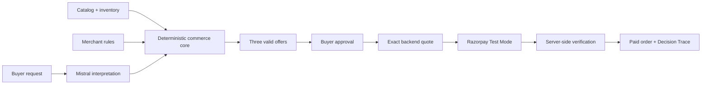

<p align="center">
  
</p>

<h1 align="center">Boli</h1>

<p align="center"><strong>Commerce for the agentic internet.</strong></p>

<p align="center">
  Turn a buyer's request into a deal a merchant can safely fulfil.
</p>

---

Most storefronts are built for people who search, filter and add items to a cart. AI buyers start somewhere else: with an outcome, a budget and a set of constraints.

Boli sits between that intent and checkout. It reads the request, finds valid products, assembles three offers, supports one bounded negotiation, suggests a relevant add-on and sends the buyer to Razorpay only after they approve the exact order.

> **AI proposes. Merchant policy decides. The buyer approves. Razorpay executes.**

Built for the **AI Growth & Agentic Commerce** track of the Razorpay Buildathon.

## One request, start to finish

> I need welcome kits for 80 employees. ₹900 max per person. Vegan and plastic-free. Hyderabad and Chennai. Within 3 weeks.

1. **Understand** — Mistral turns the request into editable constraints.
2. **Compare** — Boli builds up to three eligible offers from the merchant's real catalog data.
3. **Negotiate** — the buyer asks for a lower price; merchant rules determine what is actually allowed.
4. **Grow** — Mistral can rank a constraint-safe add-on, which the backend validates before showing it.
5. **Pay** — buyer approval creates an exact backend quote and opens Razorpay Test Mode checkout.
6. **Recover** — a demo stock failure rejects an invalid dairy substitute and offers a vegan replacement or refund.
7. **Verify** — Decision Trace shows how the request became a paid, recovered order.

The buyer stays in one workspace through request, offers, negotiation, add-on, payment and recovery. The merchant dashboard closes the story with paid sales, add-on revenue and AOV lift.

## Where AI stops

| Mistral may | Mistral may not |
| --- | --- |
| Extract buyer intent | Set an authoritative price |
| Rank already-valid offers | Approve a discount |
| Explain verified recommendations | Promise inventory or delivery |
| Interpret negotiation language | Create or verify a payment |
| Rank eligible add-ons | Issue a refund or change order state |

Every monetary and transactional decision remains deterministic and server-side. Prices are stored as integer paise; the browser never supplies a trusted total.



## What is real, and what is a demo

### Real in this repository

- Server-side Mistral structured output for intent, negotiation language, eligible-offer ranking and eligible add-on ranking.
- Deterministic price, stock, delivery, hard-constraint, margin, discount, reservation and substitution checks.
- Versioned merchant rules, exact quote fingerprints and an append-only SHA-256 decision chain.
- Razorpay Test Mode Orders and Checkout, signature verification, server-to-server payment reconciliation, raw-body webhook verification, event deduplication and idempotent refunds.
- A signed local payment adapter that uses the same payment-processing path when Razorpay credentials are unavailable.
- Typed agent-commerce discovery and purchase tools.

### Deliberately simulated

- The connected merchant and its catalog are demo data.
- The post-payment inventory failure is triggered from a clearly labelled demo control.
- Physical fulfilment is not connected to a warehouse or carrier.

CSV ingestion, Shopify/custom API connections and universal website scraping are not presented as implemented features.

## Run locally

Requires Node.js 22.13+ and pnpm.

```powershell
pnpm install
pnpm dev
```

Open [http://localhost:3000](http://localhost:3000).

### Environment

Keep secrets in `.env.local`. For live AI interpretation, ranking and add-on recommendations:

```env
MISTRAL_API_KEY=
```

For the real Razorpay Test Mode path:

```env
BOLI_PAYMENT_MODE=razorpay
RAZORPAY_KEY_ID=rzp_test_...
RAZORPAY_KEY_SECRET=...
RAZORPAY_WEBHOOK_SECRET=...
```

Boli rejects non-test Razorpay key IDs. After a signed Checkout callback, the server fetches the payment directly from Razorpay and marks it paid only when the provider reports the exact order, amount, currency and `captured` status. Configure `/api/razorpay/webhook` for `payment.captured`, `refund.processed` and `refund.failed` as the asynchronous confirmation and refund path.

Without Mistral, the app exposes an editable request form and clearly labels deterministic recommendation fallbacks. The model is never called during quote acceptance, checkout, payment verification or refund execution.

## Test the commerce core

```powershell
pnpm typecheck
pnpm lint
pnpm test
pnpm build
```

The test suite covers quoting, custom requirements, negotiation boundaries, policy checks, payment reconciliation, audit integrity, agent-tool contracts and grounded AI recommendations.

## Useful routes

| Route | Purpose |
| --- | --- |
| `/` | Buyer request and product story |
| `/request` | Constraints, offers and the complete buyer order flow |
| `/catalog` | Connected demo catalog and current product data |
| `/sell` | Merchant store overview and AI-sales dashboard |
| `/transactions` | Transaction ledger and Decision Trace entry points |
| `/merchant/products` | Working product price, cost, stock and lead-time editor |
| `/merchant/policies` | Working margin and automatic-discount rules |
| `/.well-known/boli-commerce` | Agent-commerce discovery manifest |
| `/api/agent/v1/tools` | Typed agent tools |

## Transaction guarantees

- Quote acceptance binds the exact displayed products, quantities, charges and total.
- Stock, delivery, current costs and margin are rechecked before an add-on or revised offer is accepted.
- Checkout uses the saved accepted quote; client-side prices are ignored.
- Payment events are verified, reconciled and idempotent before transaction state changes.
- Refund and replacement outcomes are mutually explicit and recorded in the same audit trail.
- Required custom requirements stop automatic approval and remain pending for merchant review.

This repository contains no deployment workflow. OpenAI Sites and hosted site-builder flows are not used.
